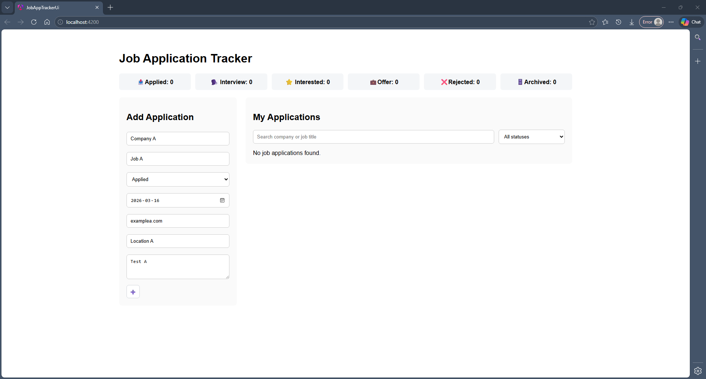
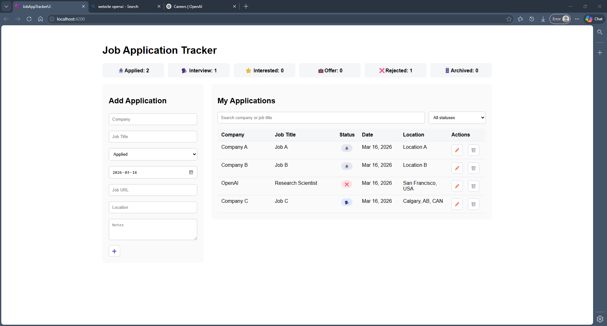
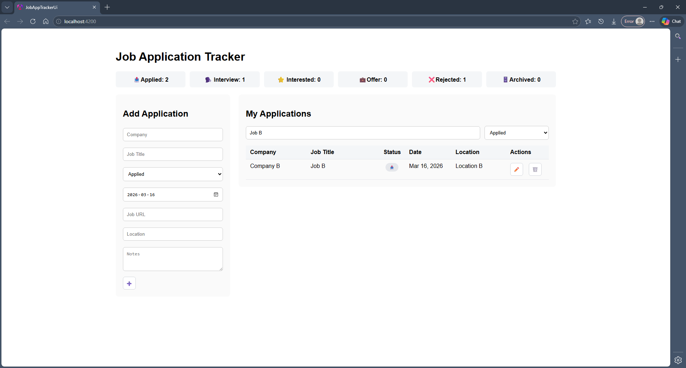

# Job Application Tracker

A full-stack job application tracking app built with Angular and ASP.NET Core Web API. It allows users to manage job applications through a simple workflow, including creating, viewing, updating, deleting, and filtering records.

## Features

- Add new job applications
- View all saved applications
- Edit existing applications
- Delete applications
- Filter by application status
- Search by company name or job title
- Persist data using SQLite
- Track status values such as Interested, Applied, Interviewing, Offer, Rejected, and Archived

## Tech Stack

### Frontend
- Angular
- TypeScript
- Template-driven forms
- HttpClient

#### *Dependency Security Update*
Running `npm audit` currently reports <strong>high-severity vulnerabilities</strong> in the `undici` package, which is pulled in as a transitive dependency of Angular build tooling:
```text
@angular-devkit/build-angular → @angular/build → undici
```

These issues originate from the development toolchain and <strong>do not</strong> affect the runtime Angular applicaiton bundle.

At the time of this configuration, the latest Angular 21 build packages available on npm still depend on a vulnerable `undici` range. Automatically applying `npm audit fix --force` would downgrade the Angular build tooling to a <strong>previous major version</strong>, which would break compatibility with Angular 21.

### Backend
- ASP.NET Core Web API
- C#
- Entity Framework Core
- SQLite

## Architecture

```text
Angular UI
   ↓
ASP.NET Core Web API
   ↓
Entity Framework Core
   ↓
SQLite
```

The frontend communicates with the backend through REST endpoints. The backend uses Entity Framework Core for data access and SQLite for lightweight local persistence.

## Screenshots

  
*Fig 1.* Fresh installation state with no data.

### Add/Edit Record
  
*Fig 2.* Form used to add a new record or edit an existing application.

### List
  
*Fig 3.* "My Applications" view listing all saved job applications with management options.

### Filters
  
*Fig 4.* List filtering by company, job title, and application status.


## Project Structure
```text
job-app-tracker
├── api
│   └── JobAppTrackerApi
├── ui
│   └── job-app-tracker-ui
├── README.md
└── .gitignore
```

## Getting Started
### Prerequisites
- .NET 8 SDK
- Node.js
- Angular CLI

### Backend Setup
```bash
cd api/JobAppTrackerApi
dotnet restore
dotnet ef database update
dotnet run
```

### Frontend Setup
```
cd ui/job-app-tracker-ui
npm install
ng serve
```
The Angular app will run locally on
```
http://localhost:4200
```

## API Endpoints
### Job Applications

- GET /api/jobapplications
- GET /api/jobapplications/{id}
- POST /api/jobapplications
- PUT /api/jobapplications/{id}
- DELETE /api/jobapplications/{id}

## Status Values

The application currently supports the following statuses:
- Interested ⭐
- Applied 📤
- Interviewing 🗣️
- Offer 💼
- Rejected ❌
- Archived 🗄️

## Current MVP Scope

This project is currently at MVP stage and supports the core job application tracking workflow from the UI through to persistent storage.

## Future Improvements

- Upgrade Angular build dependencies once patched versions resolve the `undici` transitive security advisories
- Authentication and per-user data
- Dashboard analytics and charts
- Sorting and pagination
- Better form validation
- Export to CSV
- Responsive mobile-friendly layout improvements

## Why I Built This

I built this project as a practical full-stack exercise while refining Angular and ASP.NET Core development skills. It also addresses a real workflow problem: keeping job applications organized in one place.

## Related Projects

### Vue Frontend Migration

A Vue 3 + TypeScript frontend migration of this project is being developed here:

- [job-app-tracker-vue](https://github.com/glconde-labs/job-app-tracker-vue)

The Vue version retains the ASP.NET Core backend architecture and REST API workflow while rebuilding the frontend using Vue 3, Vite, and TypeScript as a framework migration and comparative frontend architecture exercise.

## 👤 Author

George Louie Conde  
Software Developer  
Calgary, AB  
[LinkedIn](https://linkedin.com/in/glconde)  
[GitHub](https://github.com/glconde)

## License & Version
This project is licensed under the MIT License.
See the LICENSE file for details.

### Version
0.1.0